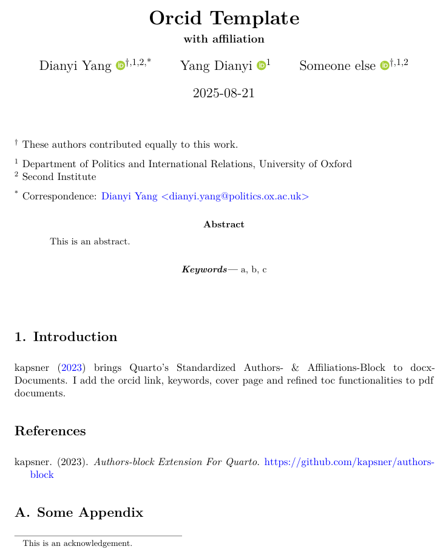

# Orcid Format

## Installing

``` bash
quarto use template kv9898/orcid
```

This will install the extension and create an example qmd file that you can use as a starting place for your article.

## Using

This project builds on kasper/authors-block and add the orcid and keywords features to the pdf format.

## Format Options

Essentially the same as kasper/authors-block, just that orcid numbers will be displayed through logos with hyperlinks and pdf format.

## Example

Here is the source code for a minimal sample document: [example.qmd](example.qmd).

The compiled pdf looks like this:


